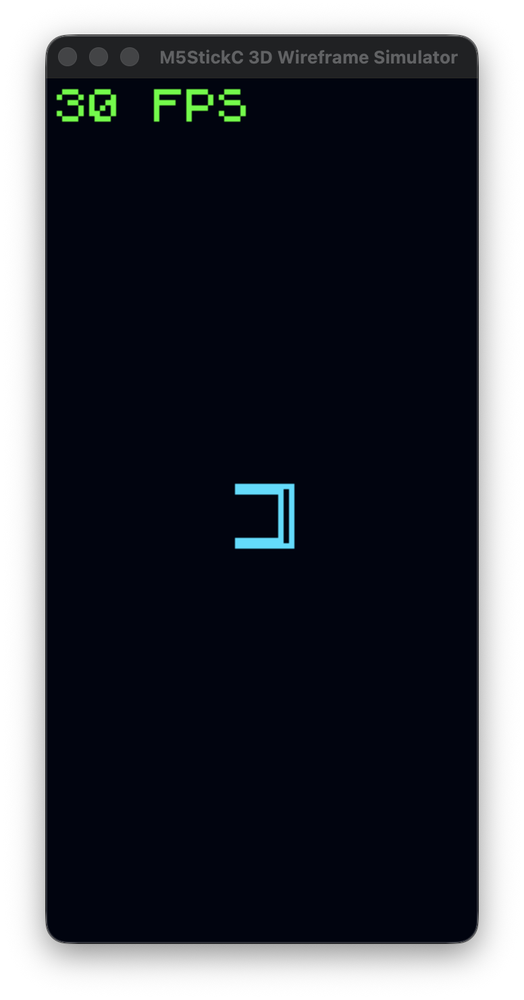
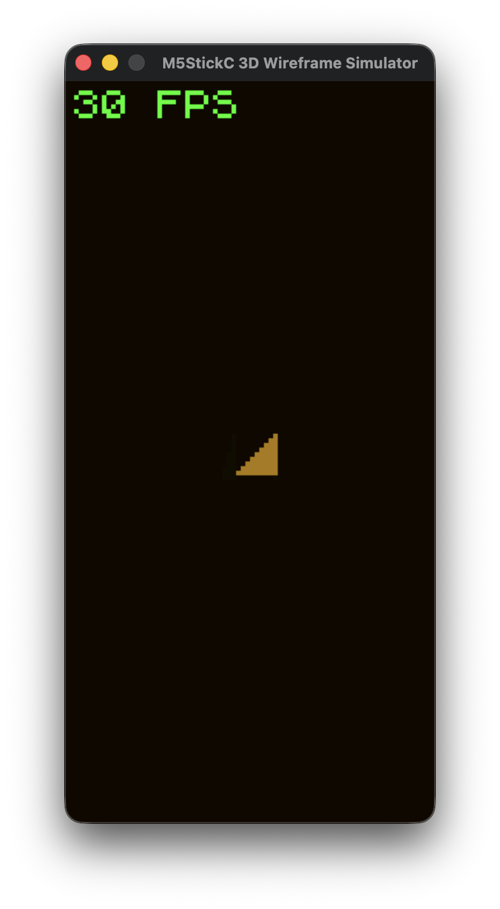
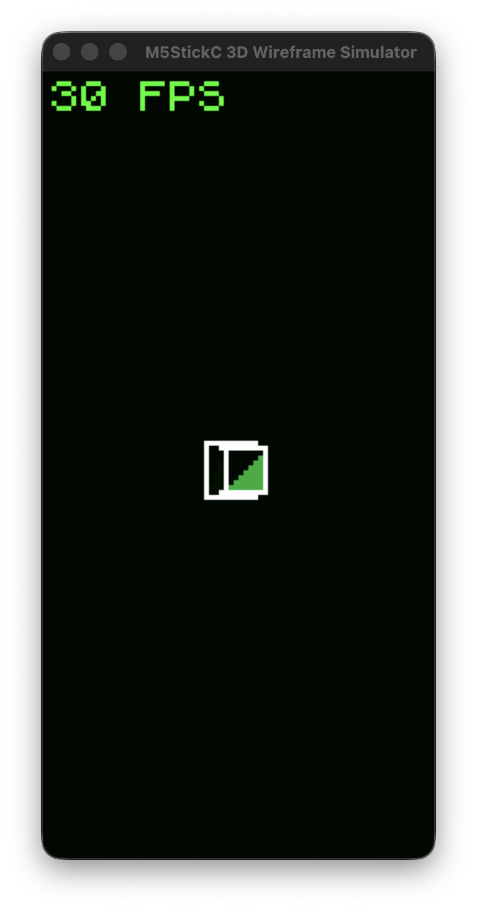
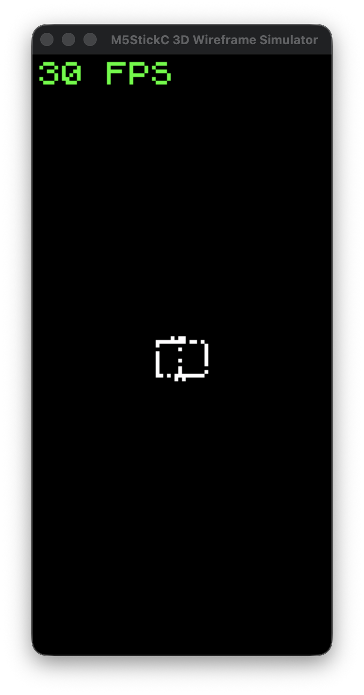

# hardcaml-playground


A 3D wireframe renderer for the M5StickC (ESP32 + 80x160 display), built from scratch in Zig. Runs on desktop via SDL2 simulator.

> **This is a teaching project.** Every source file is written to teach a concept — fixed-point math, CORDIC trigonometry, HAL abstraction, double buffering, Z-buffer rendering, and more. The code comments explain *why*, not just *what*.

<p align="center">
  
</p>

## What You'll Learn

| Source File | Concepts Taught |
|-------------|----------------|
| `src/math/fixed_point.zig` | Q16.16 fixed-point arithmetic — how to do fast math without an FPU |
| `src/math/cordic.zig` | CORDIC algorithm — computing sin/cos with only shifts and adds |
| `src/math/vec.zig` | 3D vector math — dot product, cross product, normalize |
| `src/math/matrix.zig` | Rotation matrices — 3x3 matrix construction and application |
| `src/math/projection.zig` | Perspective projection — mapping 3D world to 2D screen |
| `src/gfx/framebuffer.zig` | Double buffering — tear-free rendering via buffer swaps |
| `src/gfx/zbuffer.zig` | Z-buffer — per-pixel depth testing for correct occlusion |
| `src/gfx/draw.zig` | Bresenham's line algorithm — pixel-perfect line rasterization |
| `src/gfx/rasterize.zig` | Triangle rasterization — filling triangles with barycentric coordinates |
| `src/gfx/dither.zig` | Dithering — simulating transparency with ordered noise patterns |
| `src/gfx/effects.zig` | Post-processing — bloom glow, CRT scanlines, palette cycling |
| `src/gfx/palette.zig` | Color palettes — swapping 3 colors to transform the entire look |
| `src/scene/mesh.zig` | Mesh representation — vertices, edges, and faces in fixed memory |
| `src/scene/renderer.zig` | 3D rendering pipeline — transform, cull, project, draw |
| `src/hal/sim.zig` | Platform HAL — abstracting hardware behind a compile-time interface |
| `src/config.zig` | Compile-time configuration — tuning constants in one place |

## Screenshots

| Wireframe + Cyan | Solid + Amber | Wire+Solid + Green | Ghost + Mono |
|:---:|:---:|:---:|:---:|
|  |  |  |  |

## Architecture

```
src/
├── main.zig              # Entry point, event loop, controls
├── config.zig            # Compile-time constants (80x160, 30 FPS, limits)
├── platform.zig          # HAL interface contract
├── hal.zig               # Compile-time platform selector
│
├── math/
│   ├── fixed_point.zig   # Q16.16 fixed-point type (Fix16)
│   ├── vec.zig           # Vec2, Vec3 with fixed-point components
│   ├── matrix.zig        # Mat3 rotation matrices
│   ├── cordic.zig        # CORDIC sin/cos (no trig library)
│   ├── projection.zig    # 3D → 2D perspective projection
│   └── prime_field.zig   # Finite field arithmetic
│
├── gfx/
│   ├── framebuffer.zig   # RGB565 double-buffered display
│   ├── zbuffer.zig       # Per-pixel depth buffer
│   ├── draw.zig          # Bresenham line drawing
│   ├── rasterize.zig     # Z-buffered triangle fill
│   ├── dither.zig        # Bayer/stochastic dithering
│   ├── effects.zig       # Glow, scanlines, palette cycling
│   ├── palette.zig       # 4 color palettes (cyan, green, amber, mono)
│   ├── overlay.zig       # Debug text overlay
│   └── font5x7.zig      # Bitmap font data
│
├── scene/
│   ├── mesh.zig          # Mesh struct (vertices, edges, faces)
│   ├── mesh_catalog.zig  # Built-in shapes (cube, pyramid, icosphere, torus)
│   ├── camera.zig        # Camera position and zoom
│   ├── scene.zig         # Scene graph (multiple objects)
│   └── renderer.zig      # Full 3D rendering pipeline
│
└── hal/
    └── sim.zig           # SDL2 desktop simulator
```

## Controls

| Key | Action |
|-----|--------|
| Mouse | Rotate active object |
| Scroll / Up/Down | Zoom camera in/out |
| Z | Cycle active scene object |
| X | Cycle render mode (wire → solid → both → ghost → dissolve) |
| C | Toggle backface culling |
| V | Cycle mesh shape |
| Space | Add new object to scene |
| P | Cycle color palette |
| G | Toggle glow effect |
| S | Toggle CRT scanlines |
| D | Toggle depth coloring |
| Escape | Quit |

## Build & Run

**Prerequisites:**
- Zig 0.15+ ([ziglang.org](https://ziglang.org/download/))
- SDL2 (`brew install sdl2` on macOS)

```bash
# Run the simulator
zig build run

# Run all tests
zig build test
```

The simulator opens an 80x160 window scaled 4x to 320x640. All rendering happens at native resolution — SDL handles the upscale.

## Render Modes

| Mode | Description |
|------|-------------|
| **Wireframe** | Edges only — the classic vector display look |
| **Solid** | Z-buffered filled triangles, no wireframe overlay |
| **Wire+Solid** | Filled faces with wireframe edges drawn on top |
| **Ghost** | Dithered transparency — see-through geometry |
| **Dissolve** | Stochastic pixel dissolution effect |

Cycle modes with **X**. Combine with 4 color palettes (**P**) for 20 visual combinations.

## License

MIT — see [LICENSE](LICENSE).
